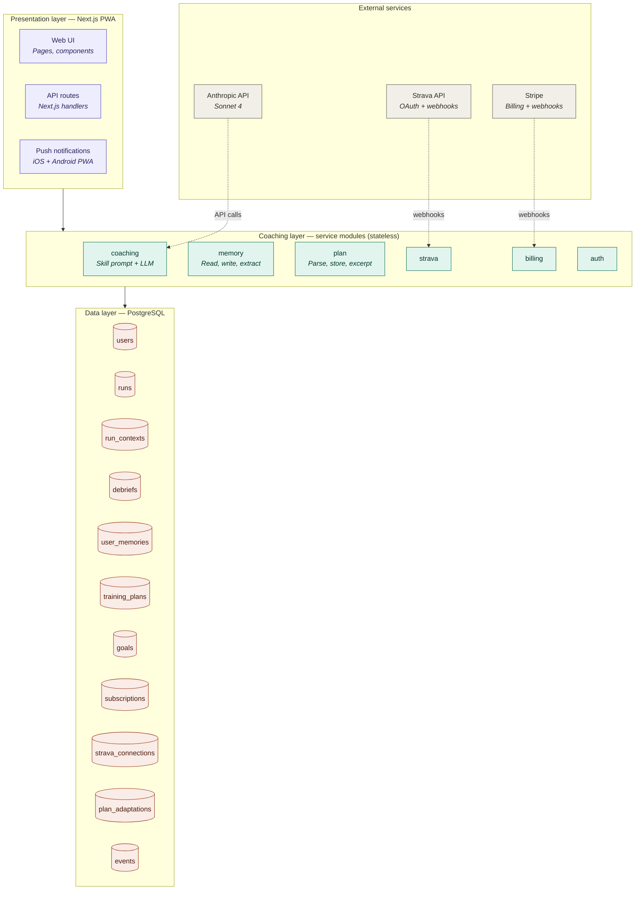
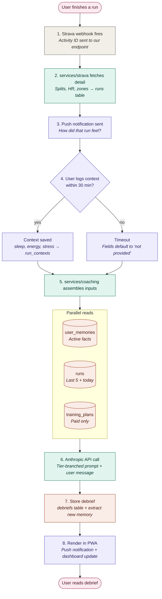

# Running Coach App — Architecture

Two views of the system: the **layered architecture** (static structure) and
the **debrief generation flow** (the most common dynamic operation).

Both diagrams are embedded as mermaid below — they render directly in GitHub,
Notion, VS Code (with extension), and most markdown viewers.

---

## Diagram 1: Layered architecture (mermaid)



---

## Diagram 2: Debrief generation flow (mermaid)



---

## Reading the diagrams

### Layered architecture (Diagram 1)

The system is organized into three layers, each with strict boundaries:

- **External services** — Strava (OAuth + activity webhooks), Anthropic
  (Sonnet 4 LLM calls), Stripe (billing webhooks).
- **Presentation layer (purple)** — Next.js PWA. Web UI, API routes, and
  push notifications. **Does not talk to external services directly** — always
  goes through the coaching/service layer.
- **Coaching layer (teal)** — Stateless service modules. Each one is a folder
  with a clear interface: `coaching` (skill + Anthropic SDK), `memory`,
  `plan`, `strava`, `billing`, `auth`. **Nothing else in the codebase imports
  the external SDKs.**
- **Data layer (coral)** — Neon Postgres (`@vercel/postgres`). All tables defined
  in `DATABASE_SCHEMA.md`.

**Why this structure matters:** every backlog item maps to exactly ONE layer.
- B-001 weekly summary → coaching layer (new module)
- B-003 wearable integration → coaching layer (new strava-like service)
- B-007 watch sync → presentation layer (new output channel)
- B-008 proactive check-ins → coaching layer + a cron trigger
- B-010 conversational follow-up → coaching layer extension + new data layer tables

No backlog item requires touching all three layers. That's the test of
whether the architecture is right.

### Debrief generation flow (Diagram 2)

The most common dynamic operation, end-to-end. Eight steps from "user finishes
a run" to "user reads debrief," with the decision diamond at step 4 handling
the case where the user skips the context form.

**Performance notes:**
- Steps 5-7 happen in a background job, not synchronously with step 4. The
  user gets "your debrief is being prepared" immediately, then a push
  notification when it's ready (usually 5-15 seconds).
- Step 5's three reads fire in parallel (`Promise.all`).
- Step 7's memory extraction is awaited (not fire-and-forget) — required to
  survive Vercel's serverless function lifecycle. The debrief is shown to the
  user only after extraction completes (or fails gracefully).

---

## Where things live in the codebase

> **Note:** The structure below is the target architecture. The current implementation
> uses `apps/web/` (Next.js monorepo) with service modules in `apps/web/lib/` as plain
> JS files, not TypeScript. See `CLAUDE.md` for the exact current file map.

```
apps/web/
  app/                        # Next.js App Router
    dashboard/                # Authenticated app
      runs/[id]/              # Run detail + debrief view
      memories/               # "What I Know About You" screen
      goal/                   # Race goal set/edit
      settings/               # Account, billing, Strava
    api/
      runs/[id]/debrief/      # Debrief generation + streaming
      runs/[id]/context/      # Context form submission
      goals/                  # Goal upsert
      memories/               # Memory CRUD
      strava/                 # OAuth + webhook handling
      stripe/                 # Checkout, webhook, portal

  lib/                        # Service modules
    coach-prompt.js           # v4.4 system prompt + buildUserMessage
    memory-extract.js         # Post-debrief Haiku extraction call
    strava.js                 # OAuth, token refresh, activity mapping
    stripe.js                 # Stripe client, getEffectiveTier
    auth.js                   # NextAuth options
    runs.js                   # getRunsForUser
    format.js                 # formatDistance, formatPace, etc.
    db-migrate-*.js           # One migration script per step

test/
  test-harness.js             # 19 scenarios against Anthropic API
  results/                    # Latest test output JSON
```

---

## Deployment topology

**MVP (single-region, single-instance):**
- Vercel hosts both Next.js apps (frontend + API routes + webhooks)
- Neon Postgres (`@vercel/postgres`) — serverless Postgres, no separate DB host needed
- Strava and Stripe webhooks point at Vercel API routes
- Anthropic calls happen from Vercel serverless functions (low latency, no egress concerns)
- No separate background worker — memory extraction runs inline in the debrief API route

**Cost estimate at MVP scale (100 users, 3 debriefs/user/week):**
- Vercel: free tier sufficient
- Neon: free tier sufficient at MVP scale
- Anthropic API: ~$2-5/month (paid user ~$0.18/month on Sonnet 4.6; free user ~$0.08/month on Haiku 4.5 — prompt caching reduces cost significantly at scale)
- Stripe: % of revenue, no flat cost
- **Total infra cost: ~$5-15/month at 100 users**

This is the right scale to test the freemium economics. At $14.99/mo with 10%
paid conversion, 100 users = 10 paying × $14.99 = $150/mo revenue, roughly
breaking even on infra. The unit economics work above that scale.
